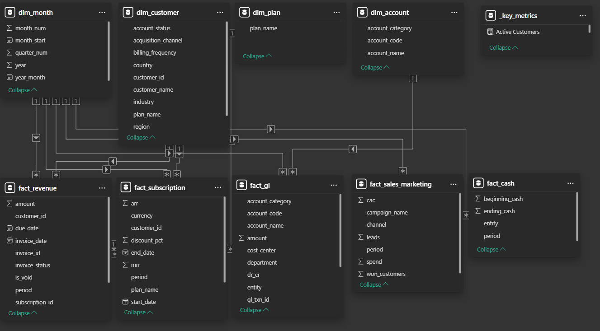
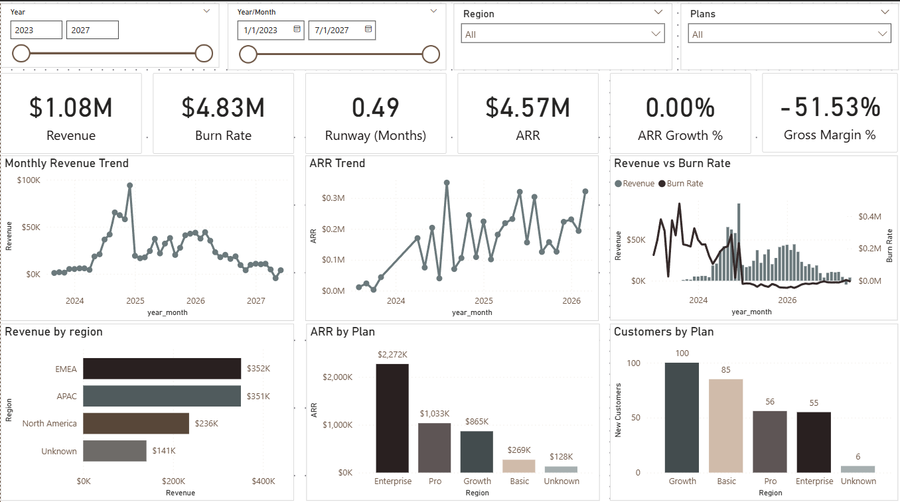
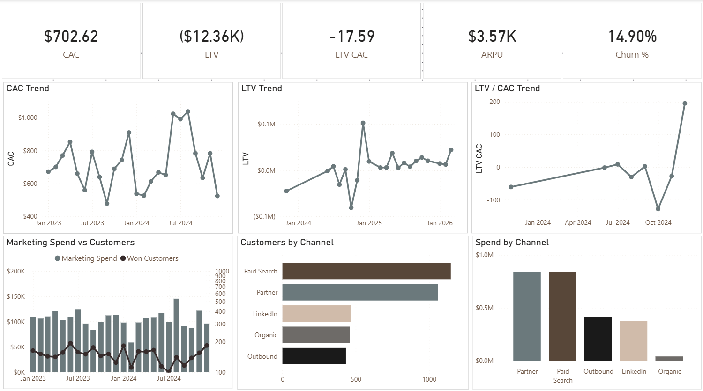
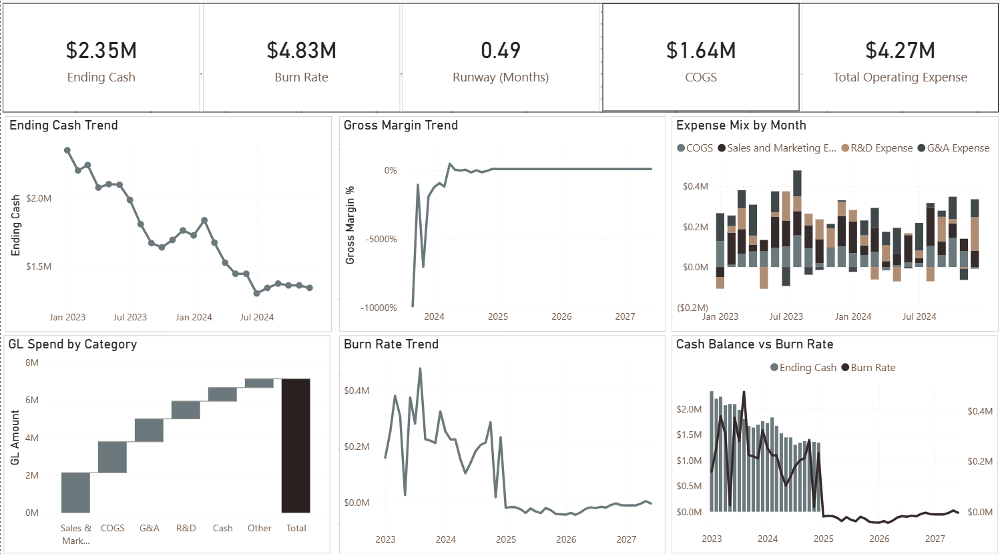

# SaaS FP&A Dashboard — End-to-End Analytics Project

An end-to-end FP&A analytics project that simulates a SaaS company finance environment using Python, SQL (DuckDB), dimensional modeling, and Power BI.

This project demonstrates how modern FP&A teams build scalable analytics pipelines, KPI models, and executive dashboards.

---

# Project Overview

This project simulates a SaaS company with:

- ARR and MRR modeling  
- Customer acquisition & churn  
- CAC and LTV metrics  
- Revenue recognition  
- GL expense modeling  
- Cash runway calculation  
- Executive dashboard reporting  

The pipeline transforms messy ERP-style data into a dimensional model powering a Power BI dashboard.

---

# Architecture

Raw ERP Data  
→ Data Cleaning (Python)  
→ Validation Checks  
→ DuckDB Star Schema  
→ KPI SQL Views  
→ Power BI Semantic Model  
→ Executive Dashboard  

---

# Tech Stack

Python (Pandas, NumPy)  
DuckDB (SQL analytics layer)  
Power BI (dashboard)  
Dimensional Modeling (Star Schema)  
SaaS Metrics (ARR, CAC, LTV, churn, runway)  

---

# Data Model

Star schema design:

Dimensions:
- dim_month
- dim_customer
- dim_plan
- dim_account

Facts:
- fact_revenue
- fact_subscription
- fact_gl
- fact_sales_marketing
- fact_cash

The model uses a shared **dim_month** table for time-based relationships.



---

# Dashboard Pages

## Executive Overview

Tracks company growth and profitability:

- Revenue  
- ARR  
- ARR Growth  
- Gross Margin  
- Burn Rate  
- Runway  



---

## Unit Economics

Tracks customer efficiency:

- CAC  
- LTV  
- LTV / CAC  
- ARPU  
- Churn %  
- Marketing efficiency  



---

## Financial Health

Tracks liquidity and cost structure:

- Ending Cash  
- Burn Rate  
- Runway  
- Expense mix  
- Margin trend  



---

# SaaS Metrics Implemented

ARR  
MRR  
Revenue Growth  
CAC  
LTV  
LTV / CAC  
Churn Rate  
Gross Margin  
Burn Rate  
Runway  
ARPU  

---

# Project Structure

```
saas-fpna-dashboard/
│
├── assets/
│   ├── executive_overview.png
│   ├── unit_economics.png
│   ├── financial_health.png
│   └── data_model.png
│
├── powerbi/
│   └── saas_fpna_dashboard.pbix
│
├── data/
│   ├── raw/
│   ├── clean/
│   └── mart/
│
├── src/
│   ├── generate_data.py
│   ├── transform_data.py
│   ├── validate_data.py
│   ├── build_duckdb.py
│   └── export_powerbi_dataset.py
│
├── sql/
│   ├── build_star_schema.sql
│   └── views_kpis.sql
│
├── run_pipeline.py
├── requirements.txt
└── README.md
```

---

# Running the Project

Install dependencies:

pip install -r requirements.txt

Run the full pipeline:

python run_pipeline.py

This will:

1. Generate messy ERP-style SaaS data  
2. Clean and transform datasets  
3. Validate data quality  
4. Build DuckDB star schema  
5. Create KPI views  
6. Export Power BI dataset  

---

# Power BI Dashboard

Open:

powerbi/saas_fpna_dashboard.pbix

Click **Refresh** to load latest data.

---

# Key FP&A Use Cases Demonstrated

Executive SaaS reporting  
Unit economics modeling  
Financial runway analysis  
Customer growth tracking  
Expense structure analysis  
Revenue forecasting base model  
Dimensional modeling for finance  

---

# Why This Project Matters

This project demonstrates:

- FP&A analytics engineering  
- SaaS metrics modeling  
- Financial KPI design  
- Data pipeline architecture  
- SQL dimensional modeling  
- Power BI semantic modeling  
- Executive dashboard design  

---

# Future Improvements

Rolling forecast model  
Scenario planning (Best/Base/Worst)  
Cohort retention analysis  
Net revenue retention  
Multi-entity consolidation  
Budget vs actual model  
Streamlit interactive dashboard  